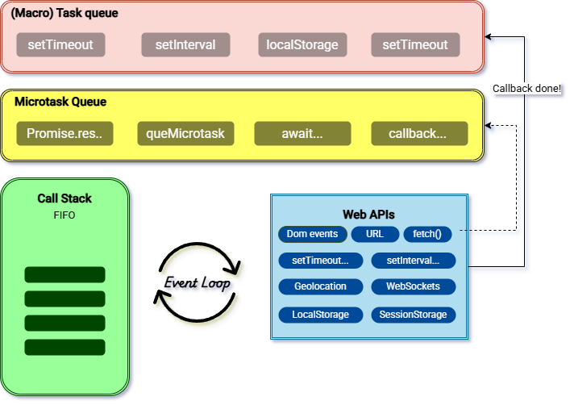

# Understanding the JavaScript Event Loop



The event loop is a fundamental concept in JavaScript that allows asynchronous, non-blocking behavior on a single thread. It's what enables JavaScript to handle operations like timers, API calls, and UI events efficiently without freezing the interface.

> The event loop is a key mechanism in JavaScript that enables developers to write asynchronous code, handle non-blocking I/O operations, and create responsive applications without relying on multi-threading. This is especially important in environments where JavaScript is the primary language for building user interfaces, such as web browsers.

## Key Components

[JavaScript - Playground](https://www.jsv9000.app/)

The event loop is the mechanism that allows JavaScript to run asynchronously using a single-threaded model. It operates with three key components:

### Call Stack

This is the main stack where all synchronous function calls are executed. JavaScript uses a single thread, and the call stack processes functions in a First In, First Out (FIFO) manner. This is priority one in execution.

### Microtask queue

This queue holds asynchronous callbacks such as Promise resolutions, async/await completions, and queueMicrotask. It is also processed in a FIFO order and has second priority, but always runs before any macro tasks.

### (Macro) Task Queue

This queue runs after the call stack and microtask queue are empty. It contains callbacks from Web APIs like setTimeout, setInterval, and others. Tasks are executed one per event loop iteration, helping ensure the UI remains responsive.

### Web APIs

These are not part of the JavaScript language itself but are provided by the environment (like the browser). Functions such as setTimeout, DOM events, and fetch rely on Web APIs. Once they complete, their callback functions are placed into the macro task queue.

## How It Works

Once the event loop starts, it checks the call stack and runs all synchronous code. Then it processes all microtasks. Once both the call stack and microtask queue are empty, it moves on to the macro task queue, executing one macro task per loop cycle.

1. Run all synchronous code in the call stack.
2. Process all pending microtasks.
3. Execute the next macro task.
4. Repeat.

e.g

```javascript
console.log("Start");

setTimeout(function () {
  console.log("Timeout callback");
}, 1000);

Promise.resolve().then(() => {
  console.log("Middle");
});

console.log("End");
```

1. "Start" is logged
2. The setTimeout callback is added to macrotask call when it is ready
3. The Promise callback resolve is added to microtask call
4. "End" is logged
5. Review the microtask and run all in the stack
6. "Middle" is logged
7. Review the macrotask and run the next intruction
8. "Timeout callback" is logged

```javascript
// output:
// Start
// End Middle
// Timeout callback
```

## Summary

The event loop enables JavaScript to remain responsive by deferring certain operations without blocking the main thread. Understanding how tasks are scheduled and executed is essential for writing efficient, non-blocking code.
